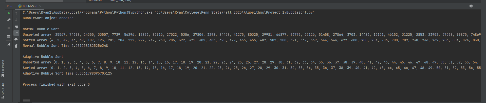
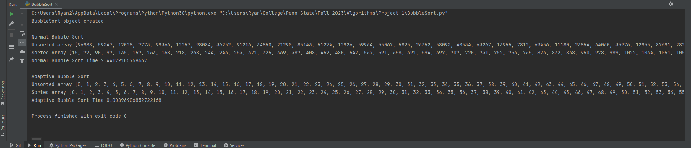
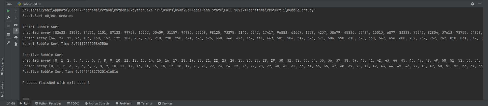
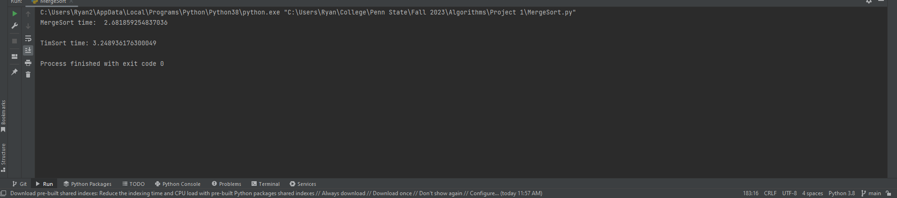
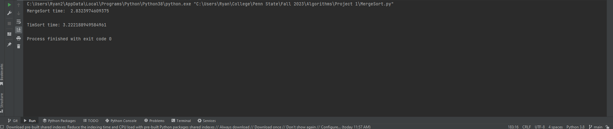
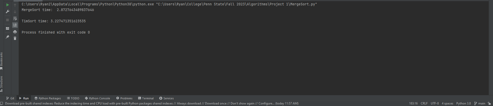

# Adaptive Bubble Sort Test  
## Adaptive Bubble Sort Explanation  
The Adaptive Bubble Sort is a very simple adaptive algorithm because it takes the original Bubble Sort algorithm and adds some minor modifications to it. Basically, a boolean variable is added to the algorithm to check for any swaps performed as the algorithm runs. If the algorithm makes it to the end of the first iteration without performing any swaps, this indicates the array is already in sorted order, so the code will break out of the main loop preventing the Bubble Sort from continuing further unnecessarily.  
## The Arrays  
For testing out both the normal and adaptive bubble sort algorithms, I used two different arrays both comprised of 5,000 integers. The normal bubble sort algorithm received an array of 5,000 integers that were randomly selected within a range of 1 to 100,000 using the randint() function of the random class. The adaptive bubble sort algorithm received an array of 5,000 integers that were already in sorted order, and this was done by simply having a for loop populate an array with integers as the loop reached its limit of 5,000.  

## The Execution  
Using the time() function from the time module in Python, upon executing a random array of 5,000 integers, the normal Bubble Sort had an average of xxx seconds., while the Adaptive Bubble Sort had an average of xxx seconds. As a best-case scenario, the Adaptive Bubble Sort would have a time complexity of O(n), but the worst-case complexity is still O(n2). Memory usage also remains the same for both bubble sort algorithms at a complexity of O(1).  
BubbleSort1 time   
BubbleSort2 time 
BubbleSort3 time   

# Hybrid MergeSort Test - TimSort
## TimSort Explanation
TimSort is a hybrid sorting algorithm that combines aspects of both Merge Sort and Insertion SortMerge Sort. With this combination of two sorting algorithms, the running time of sorting, especially with very large data sets, is improved. TimSort works best when very large data sets have segments of the set that are in order. For example, a randomly ordered set of numbers could have a segment of numbers 45, 47, 51, 78, 99, etc. already in sequential (or partially sequential) order. These segments of data that are in ascending order are called 'runs,' and TimSort takes advantage of runs by sorting them with Insertion Sort if the data is only partially in order. Then Merge Sort sorts the runs with its divide-and-conquer approach.
## The Arrays
Since Merge Sort and TimSort are much faster than Bubble Sort and work well with large data sets, I used two arrays both with a size of 10 million integers. The array gets its value from using the random class's randint() function to generate 10 million different integers with a range of 1 to 9 million, just so there can be some duplicates and numbers in partial order for TimSort.
## The Execution
On average, the Merge Sort finished execution in xxx seconds, and the TimSort finished execution within xxx seconds. Merge Sort has an average-case time complexity of O(nlogn) and a memory complexity of O(n). TimSort, on the other hand, also has an average-case time complexity of O(nlogn) and a best-case time complexity of O(n), making it quicker than Merge Sort. Similar to Merge Sort, TimSort also has a memory complexity of O(n).
MergeSort1 time 
MergeSort2 time 
MergeSort3 time 
